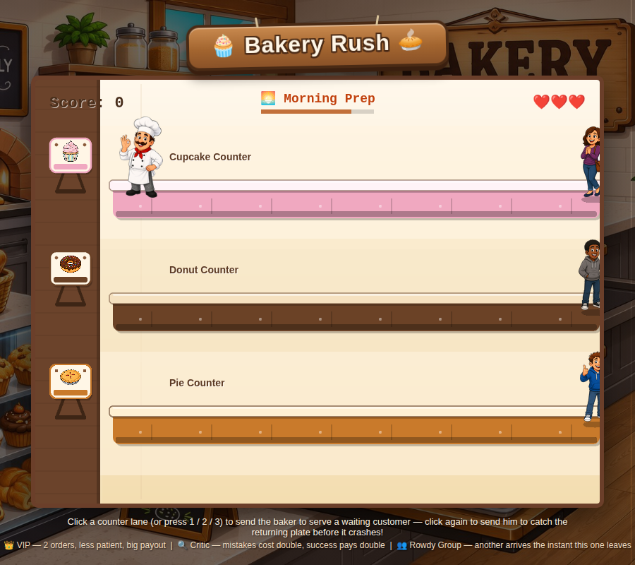

# 🧁 Bakery Rush 🥧

A Tapper-inspired arcade game: run a bakery counter, slide desserts down to customers, and catch the empty plates before they crash. Built with [Phaser 3](https://phaser.io/), bundled to run entirely offline as a single static page.



## Play it

No build step, no server, no install. Just open `index.html` in a browser.

```
git clone <this-repo-url>
cd bakery-rush
open index.html   # or double-click it, or drag it into a browser tab
```

Everything the game needs (Phaser, all art) is bundled locally, so it also works fine opened directly as a local `file://` page with no internet connection.

## How to play

Tap (or click) a counter lane — or press `1`-`5` — to send the baker there. If a customer is waiting, he serves them; if a plate is coming back, he catches it before it crashes. He can only be at one counter at a time, so timing matters. Works with mouse, touch, or keyboard, and the page resizes to fit desktop or mobile screens (with a nudge to rotate to landscape on narrow phones).

- **Cupcake Counter** — fast, straightforward orders.
- **Donut Counter** — orders come two at a time.
- **Pie Counter** — needs a moment to bake before it can go out.
- **Cookie Counter** (unlocks Day 2) — a full batch, two to serve.
- **Muffin Counter** (unlocks Day 3) — needs a moment to warm through, pays the most.

Survive a full day and the bakery opens again "tomorrow" with one more counter added — score and difficulty carry forward as an ongoing career, up to all five counters running at once.

The day runs in three phases — 🌅 Morning Prep, 🔥 Lunch Rush, 🌙 Closing Time — with special customers showing up as things heat up:

- 👑 **VIP** — orders two at once, less patient, pays big.
- 🔍 **Critic** — a miss costs double, a success pays double.
- 👥 **Rowdy Group** — another one arrives the instant this one leaves.

Customers get less patient the longer the day goes on — forgiving early, tighter by closing time — and each new day tightens the pace a little further.

## Tech

- [Phaser 3](https://phaser.io/) (bundled in `phaser.min.js`, no CDN dependency)
- Plain HTML/CSS/JS, no build tooling — the whole game is `index.html`
- All art in `assets/` is embedded into the page as base64 at load time via Phaser's Texture Manager, so it works when opened directly as a local file

## Project structure

```
index.html       game code, markup, and styling
phaser.min.js     bundled Phaser 3 library
assets/           dessert, character, and background art
screenshot.png    for this README
```

## Credits

Art by Mike. Built with [Claude](https://claude.com).
